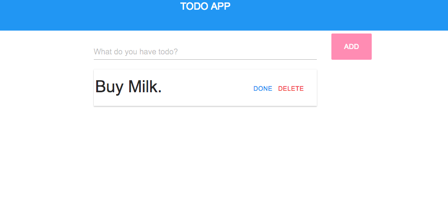

# Simple Todo App: React - ES6 - Material



Simple todo app with just react and added some material components for fun.
At this point add/delete todo items is not yet complete.
###Checking out the app###

Checkout this repo, install dependencies, then start:

```
	> git clone git@github.com:mez/todo-react.git
	> cd todo-react
	> npm install
	> npm start
```

